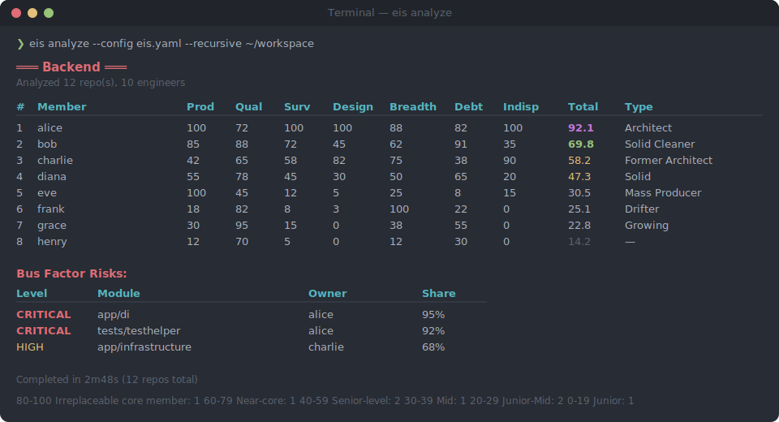
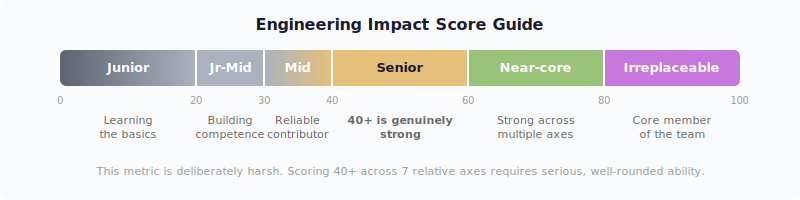
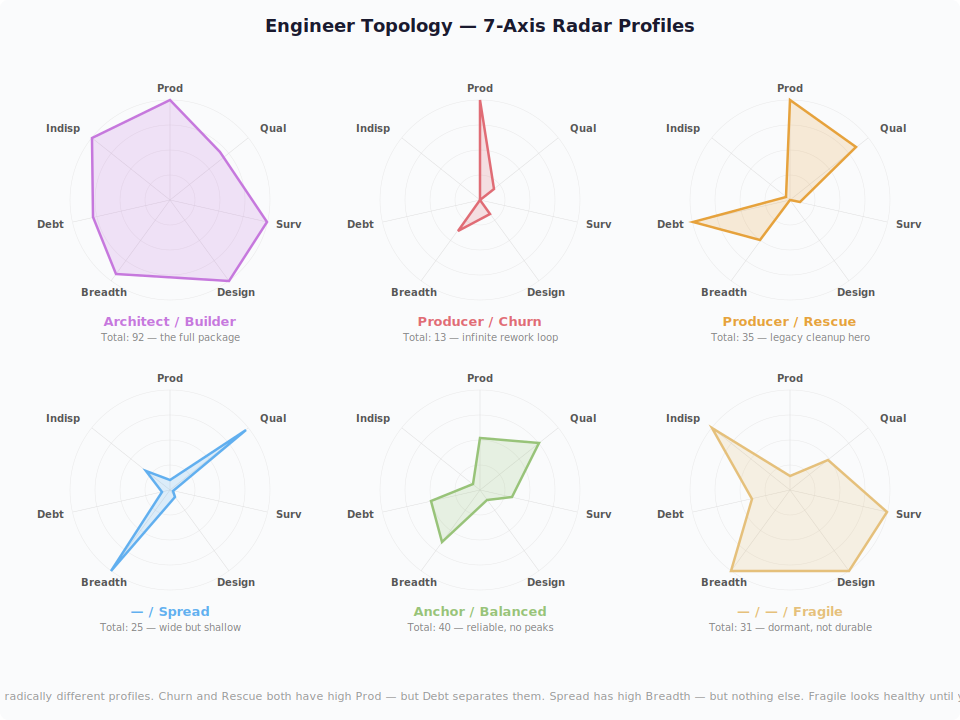

# Engineering Impact Score (EIS)

[](https://dev.to/machuz/measuring-engineering-impact-from-git-history-alone-f6c)
[](https://ma2k8.hateblo.jp/entry/2026/03/11/153212)
[](https://github.com/sponsors/machuz)

**A framework that measures real engineering impact using only Git history.**

It estimates who actually builds and sustains a system by combining production, survival, design, and maintenance signals. No surveys, no subjective reviews — just `git log` and `git blame`.

> In practice, this surfaced patterns that naive metrics miss: former architects, silent cleaners, debt generators, and bus-factor risks.



## Why This Matters

Most engineering metrics measure activity: commits, pull requests, and lines of code.

This project tries to measure something harder: who actually builds durable systems, shapes architecture, and keeps a codebase healthy over time.

## Quick Start

```bash
# Install
go install github.com/machuz/engineering-impact-score/cmd/eis@latest
# or
brew tap machuz/tap && brew install eis

# Try it on your repo
eis analyze .
```

That's it. No AI tokens, no API keys, no cloud dependencies.

```bash
# Auto-discover repos under a directory
eis analyze --recursive ~/workspace

# With config (aliases, domain mapping, weights)
eis analyze --config eis.yaml --recursive ~/projects

# Export as JSON or CSV
eis analyze --format json --recursive ~/workspace > result.json
```

## How This Differs from Existing Metrics

| Framework | What it measures | Signal source | Individual? | Key limitation |
|---|---|---|---|---|
| **DORA** | Deployment speed & stability | CI/CD pipeline | No (team) | Doesn't measure code quality or individual impact |
| **SPACE** | 5 holistic dimensions | Surveys + tools | Both | Survey-heavy, 3-6 months to implement |
| **McKinsey** | Org productivity | DORA + SPACE + custom | Mixed | [Widely criticized](https://newsletter.pragmaticengineer.com/p/measuring-developer-productivity) for output theater |
| **LOC / Commits** | Activity volume | Git | Yes | Trivially gameable, penalizes refactoring |
| **Code Churn** | % of recent code rewritten | Git | No (team) | Arbitrary time window, context-blind |
| **Bus Factor** | Knowledge concentration risk | Git blame | No (team) | Only identifies risk, not impact |
| **Git analytics tools** (Pluralsight Flow, LinearB, etc.) | Activity & cycle time | Git + integrations | Both | Still activity-focused — measures *when*, not *whether it lasted* |
| **Engineering Impact Score** | **Code that survives over time** | **Git log + blame** | **Yes** | Accuracy depends on codebase design quality |

The core gap this model fills: **existing frameworks measure activity or velocity, not whether individual contributions actually lasted.** DORA tells you how fast code reaches production. This model tells you whether it was worth deploying.

Time-decayed survival is also naturally resistant to gaming — you can't inflate your score with busy work, because only code that remains in the codebase months later counts.

## The 7 Axes

| Axis | Weight | What it measures |
|---|---|---|
| **Production** | 15% | Changes per day (absolute: configurable `production_daily_ref`, default 1000) |
| **First-pass Quality** | 10% | Low fix/revert commit ratio |
| **Code Survival** | **25%** | Recency-weighted blame survival (tau=180 exponential decay) |
| **Design** | 20% | Commits to architecture files |
| **Breadth** | 10% | Number of repositories contributed to |
| **Debt Cleanup** | 15% | Ratio of others' debt cleaned vs. own debt generated |
| **Indispensability** | 5% | Modules where you own 80%+ of blame lines (Bus Factor) |

**Code Survival is the core thesis** — exponential time decay ensures "are you *still* writing durable designs?" matters most.

## Score Guide

| Score | Assessment | Approx. Hourly (JPY) | Approx. Total Comp (USD) |
|---|---|---|---|
| 80-100 | Irreplaceable core member | ¥12,000-20,000 | $250K-400K+ |
| 60-79 | Near-core | ¥9,000-15,000 | $180K-300K |
| **40-59** | **Senior equivalent (40+ is genuinely strong)** | **¥7,000-11,000** | **$140K-220K** |
| 30-39 | Mid-level | ¥6,000-9,000 | $100K-160K |
| 20-29 | Junior-Mid | ¥5,000-8,000 | $80K-120K |
| -19 | Junior | ¥3,500-6,000 | $60K-90K |

USD figures are rough estimates and vary significantly by market (SF vs. Midwest, US vs. Europe, etc.).

**40 = Senior.** This metric is deliberately harsh. Scoring 40+ across 7 relative axes requires serious, well-rounded ability.



## Engineer Archetypes

The 7-axis distribution reveals archetypes:

| Type | Prod | Qual | Surv | Design | Breadth | Debt | Indisp | Risk |
|---|---|---|---|---|---|---|---|---|
| **Architect** | ◎ | △-○ | ◎ | ◎ | ○ | ◎ | ◎ | — |
| **Former Architect** | △ | △ | ✕ | ◎ | ○ | △ | ◎ | **⚠️ Handoff** |
| **Churn Producer** | ◎ | ✕ | ✕ | △ | △ | ✕ | △ | **High** |
| **Rescue Producer** | ◎ | △ | ✕ | △ | △ | ◎ | △ | Medium |
| **Resilient Producer** | ◎ | △ | ✕ (Robust○) | △ | △ | △ | △ | Low |
| **Mass Producer** | ◎ | △ | ✕ | △ | △ | ✕ | △ | **High** |
| **Solid Cleaner** | ○ | ◎ | ◎ | ○ | ○ | ◎ | △ | — |
| **Quality Anchor** | ○ | ◎ | △ | △ | ○ | ○ | △ | — |
| **Spreader** | ✕ | △ | ✕ | ✕ | ◎ | △ | ✕ | **High** |
| **Silent Killer** | ✕ | ✕ | ✕ | ✕ | △ | ✕ | ✕ | **High** |
| **Fragile Fortress** | ✕ | ✕-△ | ◎ | △ | △ | △ | △ | **⚠️ Hidden** |
| **Specialist** | ◎ | ◎ | ◎ | ○ | ✕ | ○ | ◎ | △ Silo |
| **Balanced** | ○ | ○ | ○ | △ | ○ | ○ | △ | — |
| **Growing** | △ | ◎ | ○ | ✕ | △ | ○ | ✕ | — |

**Former Architect** is detected by the gap between raw and time-decayed survival: code still exists in the codebase (high raw) but the author is no longer active (low decayed). Combined with high Design or Indispensability, this signals an unfilled departure — a handoff priority alert.

**Quality Anchor**: high first-pass quality with mid-level production. Writes reliable code but hasn't yet reached design influence or high survival. With the right opportunities, this type can grow into Solid Cleaner or Architect.

**Spreader**: wide presence across repos but low production, low survival, and no design involvement. Touches everything, improves nothing.

**Balanced**: no axis stands out, but Total is 30+. Steady contributor without a dominant strength or weakness. Not flashy, but not a problem either.

**Churn Producer**: mid-to-high production with terrible quality and low survival — detected when the gap between Production and Survival exceeds 30 points. Most commits are fixes or reverts, generating a constant stream of rework. Unlike Mass Producer (who may write decent first-pass code), the Churn Producer's quality score is near zero.

**Rescue Producer**: high production with low survival but high debt cleanup. This engineer is actively taking over and cleaning up others' code — often seen when someone inherits legacy modules from departed team members. Unlike Mass Producer or Churn Producer, the low survival isn't from writing bad code but from rewriting inherited debt.

**Resilient Producer**: high production with low total survival but decent robust survival. This engineer iterates heavily — writing, rewriting, experimenting — but what survives under change pressure is durable. The total survival is low because of the iteration, but the robust survival proves the end result is solid. This is the builder who improves through trial and error. Requires `--pressure-mode=include` (default).

**Silent Killer**: low production, low survival, low debt cleanup. Neither builds nor cleans — their presence is a net drain on team capacity. Only applied to authors with >= 100 commits; low-activity contributors are not labeled.

**Fragile Fortress**: high survival with low production and mediocre quality (< 70). The code survives not because it's well-written, but because nobody is changing it. If change pressure increases, this code will likely collapse. A hidden risk that survival score alone cannot reveal.

**Mass Producer, Churn Producer, and Spreader types look productive on individual metrics** but score low overall. Only multi-axis evaluation exposes them.



## Key Formulas

### Recency-Weighted Survival (Core)

```python
import math
from collections import defaultdict

tau = 180  # days — weight ≈ 0.37 at 6 months

weighted_survival = defaultdict(float)
for line in blame_lines:
    days_alive = (now - line.committer_time).days
    weight = math.exp(-days_alive / tau)
    weighted_survival[line.author] += weight
```

### Debt Cleanup Ratio

```python
for fix_commit in fix_commits:
    fixer = fix_commit.author
    for changed_line in fix_commit.changed_lines:
        original_author = git_blame(file, at=parent_commit)
        if original_author != fixer:
            debt_generated[original_author] += 1
            debt_cleaned[fixer] += 1

debt_ratio = debt_cleaned / max(debt_generated, 1)
# > 1 = Cleaner   |   < 1 = Debt creator
```

### Indispensability (Bus Factor)

```python
for module in all_modules:
    top_share = max(blame_distribution[module].values()) / total
    if top_share >= 0.8:
        critical_modules[top_author].append(module)   # CRITICAL
    elif top_share >= 0.6:
        high_risk_modules[top_author].append(module)   # HIGH

indispensability = critical_count * 1.0 + high_count * 0.5
```

### Normalization & Total Score

```python
# Absolute axes (cross-org comparable):
#   Production: min(changes_per_day / production_daily_ref * 100, 100)
#   Quality: 100 - fix_ratio (already 0-100)
#   Debt: bounded 0-100 scale

# Relative axes (normalized within domain):
#   Survival, Design, Breadth, Indispensability

# Scored per domain (Backend/Frontend/Infra/Firmware separately)
total = (
    norm_production * 0.15
    + norm_quality * 0.10
    + norm_survival * 0.25
    + norm_design * 0.20
    + norm_breadth * 0.10
    + norm_debt_cleanup * 0.15
    + norm_indispensability * 0.05
)
```

## Design Principles

- **BE / FE / Infra / Firmware are scored separately** — mixing them contaminates rankings; auto-detected from file extensions or configured explicitly
- **Hybrid scoring** — Production, Quality, and Debt use absolute scales (cross-org comparable); Survival, Design, Breadth, and Indispensability use relative normalization within domain
- **Debt threshold** — members with fewer than 10 debt events get a neutral score (50) to avoid extreme ratios
- **Accuracy scales with codebase design quality** — well-structured codebases (Clean Architecture, DDD) yield more meaningful scores. If the score doesn't match gut feeling, it may signal poor codebase structure rather than a metric problem

## CLI Options

```
eis analyze [flags] [path...]

Flags:
  --config <path>     Config file (default: eis.yaml)
  --recursive         Recursively find git repos under given paths
  --depth <n>         Max directory depth for recursive search (default: 2)
  --format <fmt>      Output format: table, csv, json (default: table)
  --tau <days>        Survival decay parameter (default: 180)
  --sample <n>        Max files to blame per repo (default: 500)
  --workers <n>       Concurrent blame workers (default: 4)
```

## Configuration

See [`config.example.yaml`](config.example.yaml) for all options:

- **Domains**: explicit repo-to-domain mapping (Backend/Frontend/Infra/Firmware). Repos not listed use auto-detection from file extensions
- **Exclude repos**: skip specific repos from analysis
- **Production daily ref**: baseline for absolute Production scoring (default: 1000 changes/day = score 100)
- **Aliases**: merge variant git author names into canonical names
- **Exclude authors**: filter out bots and non-human contributors
- **Architecture patterns**: define which files count as "design files" for the Design axis. Defaults:
  - Backend: `*/repository/*interface*`, `*/domainservice/`, `*/router.go`, `*/middleware/`, `di/*.go`
  - Frontend: `*/core/`, `*/stores/`, `*/hooks/`, `*/types/`
  - Override in `eis.yaml` to match your project structure (e.g., `*/proto/`, `*/migrations/`, `Makefile`)
- **Blame extensions**: file extensions for blame analysis
- **Weights**: customize axis weights (default: Survival 25%, Design 20%, Production 15%, Debt 15%, Quality 10%, Breadth 10%, Indispensability 5%)
- **Survival tau**: decay half-life in days (default: 180)
- **Debt threshold**: minimum events for debt score (default: 10)

### What You Get

- **Rankings table** with all 7 axis scores, total, and **Active** indicator (✓ = committed within last 6 months)
- **Archetype classification** with confidence scores (0.0-1.0) and secondary archetype — e.g., `Quality Anchor (0.85)` primary, `Former Architect (0.65)` secondary
- **Bus Factor risk map** showing modules with dangerous ownership concentration
- Color-coded output for quick visual scanning
- **JSON / CSV export** (`--format json|csv`) for dashboards and programmatic use

### Supported Languages

Works out of the box with: Go, TypeScript/JavaScript, Python, Rust, Java, Ruby, C/C++ (including firmware/embedded), Scala, Haskell, OCaml. Additional extensions can be added via `blame_extensions` in `eis.yaml`.

### Alternative: Claude Code

For deeper qualitative analysis (actionable insights, team recommendations), you can also use Claude Code:

```bash
claude "Follow the instructions in PROMPT.md to calculate Engineering Impact Scores for my team. Use config.yaml for configuration."
```

## Blog Posts

- [Japanese / はてなブログ](https://ma2k8.hateblo.jp/entry/2026/03/11/153212) — 日本語版フル記事（実測結果付き）
- [English / dev.to](https://dev.to/machuz/measuring-engineering-impact-from-git-history-alone-f6c) — English version with images and real-world rankings

## Roadmap

- [x] Scoring methodology and formulas
- [x] Claude Code analysis prompt
- [x] Data collection script
- [x] Configuration template
- [x] Standalone CLI tool (`eis`) — zero AI dependency
- [x] Homebrew distribution (`brew install eis`)
- [x] Recursive repo discovery (`--recursive`)
- [x] Author alias mapping via config
- [x] Concurrent blame analysis (worker pool)
- [x] Domain separation (BE/FE/Infra/Firmware) with auto-detection
- [x] Absolute scoring for Production (per-day rate) and Quality (fix ratio)
- [x] Configurable domain mapping, repo exclusion
- [x] JSON / CSV output format (`--format json|csv`)
- [ ] GitHub Action for automated quarterly tracking
- [ ] HTML dashboard visualization
- [ ] Multi-language commit message support for Quality detection

## Special Thanks

- [@reizist](https://github.com/reizist) — identified that `exclude_file_patterns` was not applied to git log and blame targets

## Support

If this metric helped you see your team differently, consider supporting the project:

- [GitHub Sponsors](https://github.com/sponsors/machuz)
- PayPay: `w_machu7`

## License

MIT
