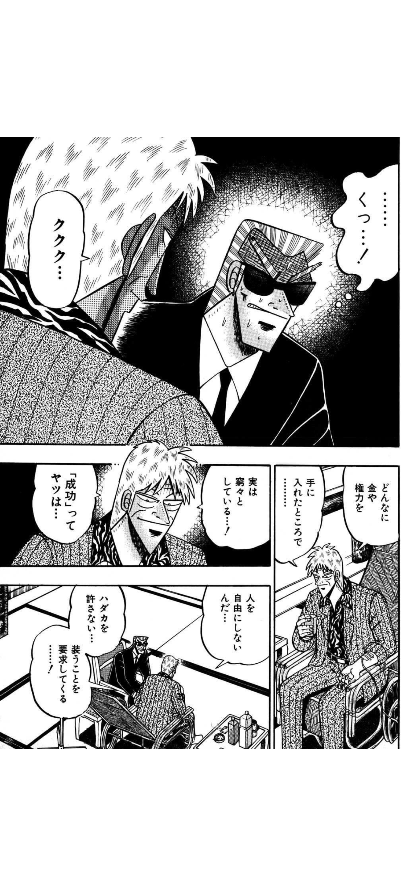
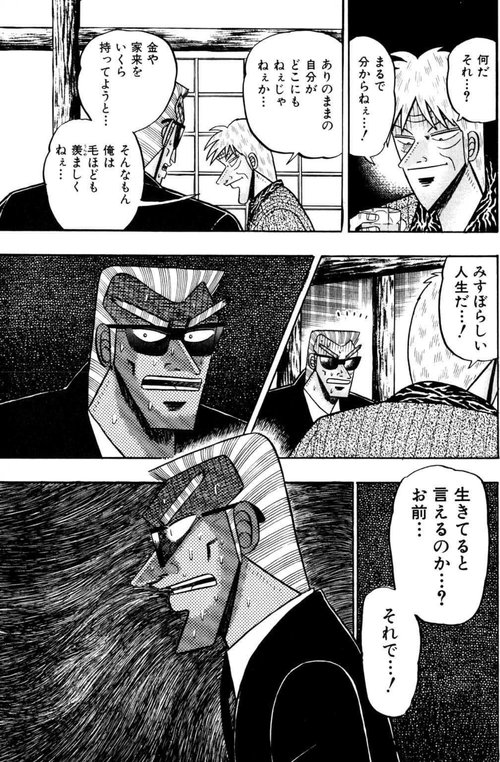
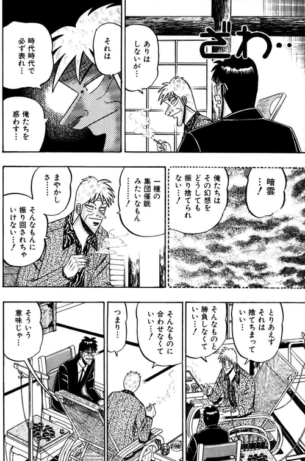
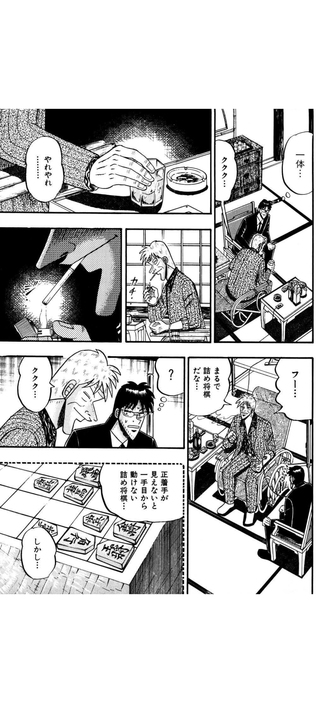
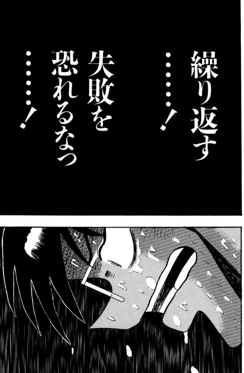

私の活動の根底には、  
「ただ続くこと」よりも「本質に触れられていること」を重視する感覚がある。

『天』のアカギの死生観に惹かれるのも、  
死を恐れないという表面的な強さより、  
鈍ったまま惰性で生き延びることを拒否する姿勢に共感するからだと思う。

私は、人や組織やプロダクトが、  
ただ安全に、ただ無難に続いていくことに、あまり価値を感じない。  
むしろ、危うさがあっても、  
そこに本質への意志や、確かな熱や、  
「これを生み出す意味がある」と言える実感があることを大切にしたい。

もちろん、密度を求める生き方は消耗もしやすい。  
だから必要なのは、惰性に流されることではなく、  
高い純度を保ったまま長く進める仕組みをつくることだと思っている。

私にとって仕事とは、  
単に何かを処理したり最適化したりすることではない。  
自分が本当に価値があると信じるものに賭け、  
それを世界に残る形へ変えていく営みである。

---

> **心理OSとは、外部の成功・正論・空気に上書きされず、自分の意思で動き続ける状態を保つための作動原理である。**

## 1. 矜持がはがれる日々

『天』の最終盤、アカギは認知症が進行しており、記憶や判断が一日一日鈍っていく ── つまり、矜持が少しずつ剥がれていく状況にある。金にも権力にも名声にも目をくれず、**自分が自分であること**だけを求めて生きてきた男が、その最後の稼働状態をどう保つか。

私たちにアカギほどの覚悟はない。それでも、矜持がはがれる日常は意外と身近にある。顧客の声、業界の常識、「正しい経営」、ベストプラクティス、成功事例の真似。毎日少しずつ、芯が削られていく。

この記事は、**その削られる感覚の正体と、それに抗う作動原理を「心理OS」と呼んで扱う**。

## 2. 積みすぎた成功という棺

アカギは成功を積むとすぐ崩して平に戻すことを繰り返していた。

> 成功は一筋縄では行かない。1、2はよいが、10、20と積むと贅肉のように体を重くする

最初の成功は生の輝きと結びついている。勝つことで命が光る。そこまではいい。だが積み重なると性質が変わる。輝きが枷になる。成功は**成功し続ける人生を要求してくる**。失敗を許さない。裸を許さない。装うことを強制してくる。

> みすぼらしい人生だ —— 生きてると言えるのか、お前、それで

組織でもまったく同じことが起きる。過去の勝ちパターン、顧客への約束、築いたブランド。最初は生を輝かせていたそれらが、**成功という棺**に変わる瞬間がある。保守的で芯のないプロダクトは、能力が足りないから生まれるのではない。**積みすぎた成功が心理OSを乗っ取った結果**として生まれる。

## 3. まやかしの集団催眠

アカギは「まとも」「正常」「正しい人生」に対してはっきりとした態度を取る。

> 正しい人間とか、正しい人生とか、何言ってんだか意味不明、気持ち悪いじゃないか
> そんなものは元々ありはしない。ありはしないが、時代時代で必ず現れ、俺らを惑わす暗雲
> 一種の集団催眠みたいなもの。まやかしさ

時代ごとに「まとも」の中身は変わる。かつては長時間労働が、いまは別の何かがその座にある。**中身は変わるが、心理OSを乗っ取ろうとする作用は同じ**。正論、べき論、ベストプラクティス、SNSで擦られる成功像 —— 全部、影を濃くしに来る。

## 4. 詰将棋ではないこの世 —— 命は動くこと

正着手が見えないと一歩目から動けない詰将棋。アカギはそれを「この世のありようと違う」と切り捨てる。

> 不完全でも動くことが道を切り開く
> 真面目であることは悪癖だ。それがお前を止めちまった、九年間も

そして命について、こう言う。

> 命の最も根源的特徴は、活動、動くってことだ。動かなくなったら即、死なんだから
> 才能と命は関係ない。凡庸なやつでも輝いているやつはたくさんいる

ここが心理OSの核だ。**健全な心理OSは、常に小さく動いている**。完璧な合意・完璧な根拠・完璧な証跡を待たない。才能の大小で決まるものでもない。温度があるかどうか、動いているかどうか、それだけ。

## 5. 熱い三流なら上等よ

そしてあの一節が来る。

> いいじゃないか、三流で。熱い三流なら上等よ。まるで構わない、構わない話だ
> だから、恐れるな……！ 繰り返す……！ 失敗を恐れるなっ……！

心理OSの健全状態は、これ以上の言葉で言い換えにくい。三流でいい。上等だ。**ただし熱が残っていること、それだけが条件**。

ここで言う熱とは、感情の強さではなく、**自分の意思で動き続けている状態そのもの**を指す。声が大きいかどうか、燃え上がっているかどうかとは関係がない。

つまり心理OSとは、**自分が自分のまま、温度を保って稼働し続けている状態**のこと。成功にも、正論にも、集団催眠にも乗っ取られていないこと。みすぼらしくても、世間から「まともじゃない」と言われても、**熱だけは誰にも明け渡さない**こと。

アカギが死の際に選んだのは、この心理OSを最後の瞬間まで手放さないことだった。

> 無念が願いを光らせる

無念は弱さではない。**無念こそ、心理OSがまだ動いている証拠**だ。満足し切った者、欲を失った者、集団催眠に同意した者は、もはや無念を持てない。

## 6. 熱の向き —— やる気のある無能との境界

ここで一つだけ断っておきたい。「熱い三流なら上等」は、**熱の向きが自分の内側に向いているときだけ**成り立つ。

やる気のある無能が厄介なのは、熱そのものではなく、**熱の向き**のほうだ。彼らは自分を三流と認めず、一流のつもりで動き、失敗を外部の責任として処理する。熱は「自分の正しさを証明する」方向にだけ注がれ、学習と調整には使われない。これは心理OSがすでに集団催眠(正しさ神話)に乗っ取られた状態で、アカギの対極にある。

熱い三流は、自分が三流だと分かっていて、それでも動く人だ。失敗を反故にする柔軟性は持ちつつ、傷つきから学ぶことは捨てない。**熱の消費先が、承認ではなく探索に向いている**(アドラー心理学でいう「承認欲求」と「貢献感」の違いに近い)。

この区別を置かないと、「熱い三流で上等」はただの自己肯定の言い訳に化ける。熱の量ではなく、熱の向きが問われる。

## 終わりに

正直に言えば、私自身もこの状態を常に保てているわけではない。気づけば成功の棺に入りかけていることもあるし、集団催眠に同意している日もある。それでも、気づいたときに戻れる場所として「心理OS」を言語化しておきたかった。

矜持がはがれる日々の中で、何を選ぶか。

成功の棺に入るか、集団催眠にかけ直されるか、詰将棋の一手目を待ち続けるか、それとも ——

熱いまま、三流のまま、動き続けるか。

心理OSは、その選択の現場の名前だ。組織にも個人にも、等しく存在する。アカギのように強くある必要はない。ただ、**熱だけは明け渡してはいけない**。

## 二重の設計として —— 構造駆動との接続

**組織が人を壊さないために構造駆動が要る。**  
**成功や正論が自分を壊さないために心理OSが要る。**

どちらか一方だけでは足りない。**構造だけでは人は空洞化し、心理だけでは再現性がない**。この二つが噛み合ったとき、初めて持続可能な「強さ」が生まれる。

本書はそのうちの内側を扱う。外側は別書『構造駆動エンジニアリング組織論』に委ねる。
