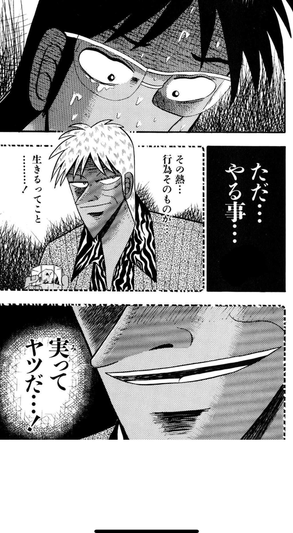
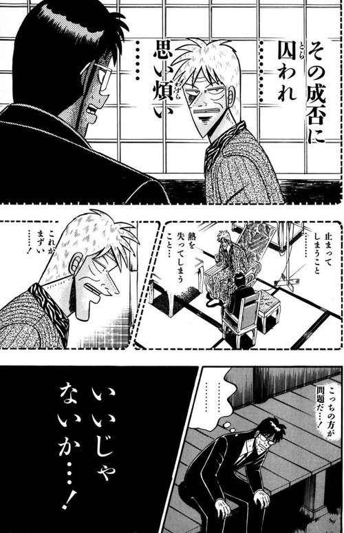
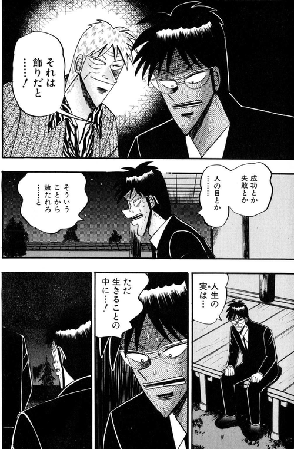
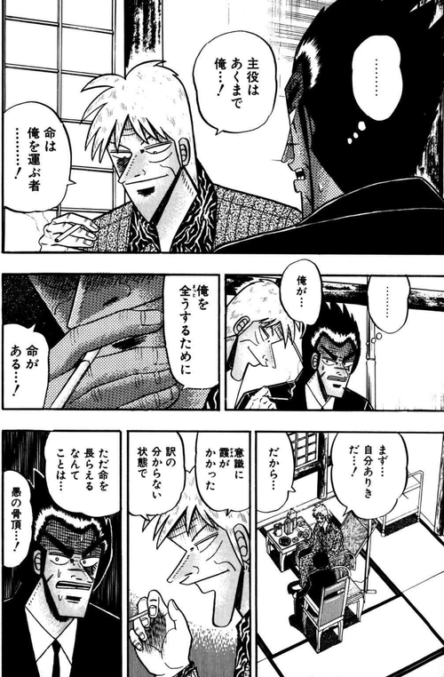
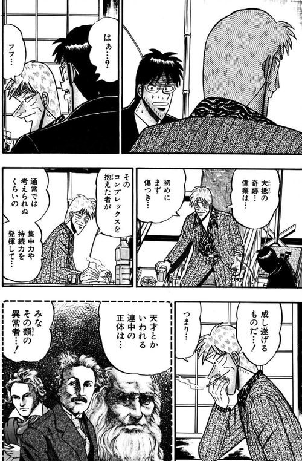
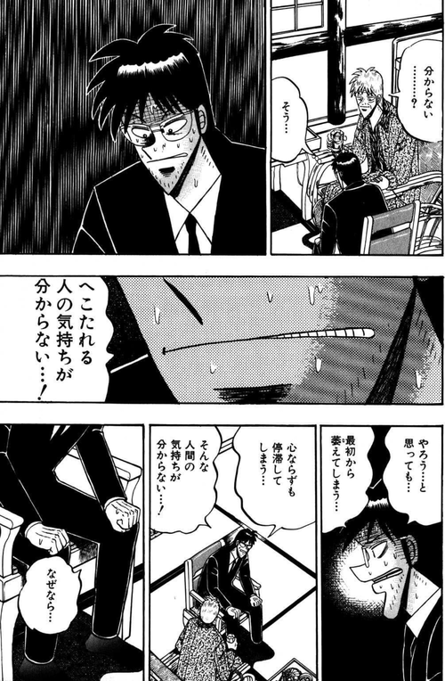

ch0 で心理OSを「熱を明け渡さない状態」と定義した。ch1 で「どう自分の状態を知るか」を扱った。本章では一歩踏み込んで、**強い心理OSとは具体的にどういう状態か、何が起きるのか**を扱う。

強さとは、完璧でいることではない。声が大きいことでも、燃え盛っていることでもない。**熱がどこを向き、どれだけ純度を保って動き続けているか**。それだけの話だ。

---

## 1. 熱とは何か —— 行為そのもの

アカギは「熱」を感情の激しさとしてではなく、もっと根本的なものとして語っている。

> ただ……やる事……その熱、行為そのもの、生きるってこと……実ってヤツだ……！

**熱とは、自分の意思で動いている行為そのもの**のこと。結果ではない。感情でもない。燃焼の激しさでもない。**いま動いていること、その事実そのもの**が熱だ。

この定義は、ch0 で触れた「命の最も根源的特徴は、活動、動くってことだ」と対になっている。命が動きなら、心理OSの健全性は動きの内圧で測られる。外圧で動いている動作には熱は宿らない。依頼に応えて動く、期待に応えて動く、流れに乗って動く —— それらがダメなのではない。ただ、それだけで構成された日々には、熱がない。

内圧で動いている瞬間を、一日のうちにいくつ持てているか。強い心理OSとは、**この内圧駆動の比率が高い状態**のことだ。

## 2. 成否に囚われないこと

強い心理OSの次の条件は、成否に思い煩わされないことだ。ここには誤解されやすい一節がある。

> 成功を目指すなと言ってるんじゃない……！
> その成否に囚われ、思い煩い……止まってしまうこと……

アカギは成功を否定していない。**成否に囚われることを否定している**。目指すのはいい。勝ちに行くのもいい。ただし、**結果が出るまで動きを止めたり、結果が出た後に保身を始めたり**すれば、その瞬間に心理OSは乗っ取られる。

ここに続く一節はさらに鋭い。

> それは飾りだと……成功とか失敗とか人の目とか……そういうことから放たれろと

成功と失敗は、心理OSから見れば**同じカテゴリ**なのだ。どちらも飾り。どちらも「外側からの評価」。勝って慢心するのも、負けて委縮するのも、等しく熱を奪う。**熱は、成否の外側にしか存在しない**。

強い心理OSは、勝ちも負けも同じ強度で通過する。どちらの場合も、次の動きに熱を繋げる。

## 3. 主役は俺 —— agency の極限

強い心理OSのもう一つの特徴は、**主体の反転**にある。

> 主役は……あくまで俺……！ 命は俺を運ぶ者……！
> 俺を全うするために……命があるっ……！

普通、人は「命が主役で、自分はそれに従う」と感じている。命に生かされ、命の要請に応じて動く。これは命に仕える受動態の生だ。

アカギはそれを反転させる。**主役は俺、命は乗り物**。命は俺を運ぶものであって、俺が仕える対象ではない。俺を全うするためにこそ、命がある。この配置の反転が、agency の極限だ。

強い心理OSの人は、日々の行動がこの反転のどちら側から出てくるかを自覚している。「義務だから動く」「体調が許すから動く」ではなく、「自分がこうありたいから、体と時間と命を使う」。

主体の置き所がこちら側にあるかどうか。ここが、強い心理OSと弱い心理OSを分ける**もっとも深い一線**だ。

## 4. 強い心理OSで何が起こるか

では、熱の純度が高く、成否に囚われず、主体を自分に置き続けている人には、何が起きるのか。三つ挙げる。

### (a) 異常な持続力

外から見ると、強い心理OSの人は**異常に続けられる**。何十年も同じテーマを深掘りし続けたり、何度崩れても戻ってきたり、周囲が諦めた地点からさらに進んだりする。

> 天才とかいわれる連中の正体は……みな、その類の異常な持続力を発揮している

天才と呼ばれる人々の多くは、**才能の大きさではなく、熱を保ち続ける能力**によって異常な結果に到達している。同じ集中を同じ純度で、常人が続けられない時間にわたって持ち続けられること。これは才能ではなく、心理OSの作動強度の問題だ。

「自分には才能がない」という嘆きは、たいていの場合、**才能の問題ではなく、熱を保てていない問題**を見誤っている。

### (b) 再起動力

強い心理OSは、崩れない心ではない。**崩れても戻れる心**だ。

外圧に揺さぶられる瞬間はある。成功に慢心する瞬間も、失敗に呑まれる瞬間もある。集団催眠に同意しそうになる日もある。ただ、そこから**戻る速度が速い**。気づけば戻る。戻れることを信じられているから、崩れそのものに怯えない。

再起動力は、ch1 で扱った自己観測の副作用でもある。「観測した瞬間、慣性ではなく意思で動く状態に戻る」。この戻り方が速い人を、強い心理OSと呼んでいる。

### (c) 外部評価からの独立

強い心理OSは、承認・比較・義務で動かない。これは「外部評価を無視する」ということではなく、**外部評価を判断材料としては受け取るが、動力源としては使わない**という態度だ。

評価は情報として扱う。動くか動かないかは、自分の熱で決める。この分離ができている人は、褒められても浮き上がらず、貶されても縮まない。外から見ると、**反応が薄い、あるいは鈍感に見える**こともある。

しかしそれは鈍感ではなく、**動力源を内側に置いている**ことの帰結だ。

## 5. 強さの副作用 —— 理解されない

強い心理OSは絶対善ではない。副作用がある。最大の副作用は、**周囲から理解されにくくなる**ことだ。

> へこたれる人の気持ちが……分からない……！

これはアカギを評した他者の言葉だが、鋭い。**強い心理OSの人は、弱い心理OSの状態が分からなくなる**。なぜ動けないのか、なぜ諦めるのか、なぜ外圧に屈するのか —— 理屈では理解できても、**体感として共有できない**。

ここで一つ断っておく。**これは優劣の話ではなく、作動状態の違いの話だ**。強い心理OSが偉いわけでも、弱い心理OSが劣っているわけでもない。ただ、動力源の置き場所が違うために、同じ現場に立っても見えるものが違う。それだけのことだ。

その上で、これは傲慢とは別の意味で、構造的な分断を生む。強い心理OSは強い心理OSを呼び、弱い心理OSは弱い心理OSを呼ぶ。この分離は、**組織を運営する上で深刻な問題になる**(この論点は次章で扱う)。

だから強さは、**理解されないことを引き受ける覚悟**とセットになる。理解されながら強くあることは、ほぼできない。強さは、孤独の密度と引き換えに手に入る。

## 6. 温度の物理学 —— 熱量・純度・反応速度・再起動力

ここまでの内容を、温度の比喩で整理しておく。心理OSの強さは、一次元ではない。少なくとも四つの量がある。

**熱量**  
どれだけ動いているか。日々どれだけ内圧で動いているか。ゼロに近いと、心理OSは停止状態。

**純度**  
熱がどこから燃料を取っているか。承認・比較・義務・恐れから取っているなら、純度が低い。探索・好奇心・納得から取っているなら純度が高い。同じ熱量でも、純度が低い熱は持続しない。

**反応速度**  
停滞を感知してから、次の動きに移るまでの遅延。強い心理OSほどこの遅延が短い。「何かおかしい」と感じた瞬間に、もう次の動きが始まっている。

**再起動力**  
崩れてから戻るまでの速度と確度。一度でも戻れた経験がある人は、この値が高い。

四つすべてが高い必要はない。ただ、**純度が低ければ、熱量がいくら高くても強い心理OSにはならない**。激しく燃え上がっている人が必ずしも強いわけではない理由がここにある。

## 終わりに —— 次章への橋

強い心理OSとは、完璧な心ではない。揺るがない心でもない。**熱を明け渡さず、成否に囚われず、主体を自分に置き、崩れても戻り続ける**状態のことだ。

そして、§5 で触れた通り、**強さは孤独の密度と引き換えに手に入る**。そしてその孤独は、組織の中で必ず歪みとして現れる。

これは個人の内側の話だ。だが、個人の心理OSは、外に対して閉じていない。集団の中で伝染したり、反射したり、抑圧されたりする。強い心理OSを持つ個人が組織に入ったとき、**何が壊れるか**。

次章では、この衝突面を扱う。
