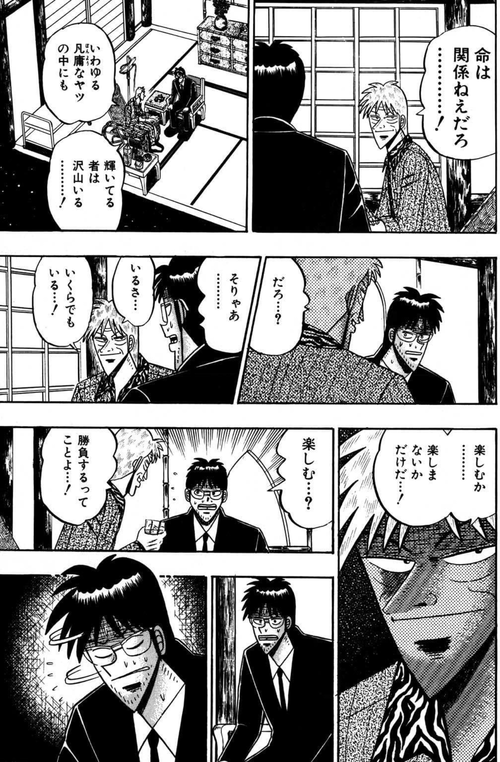
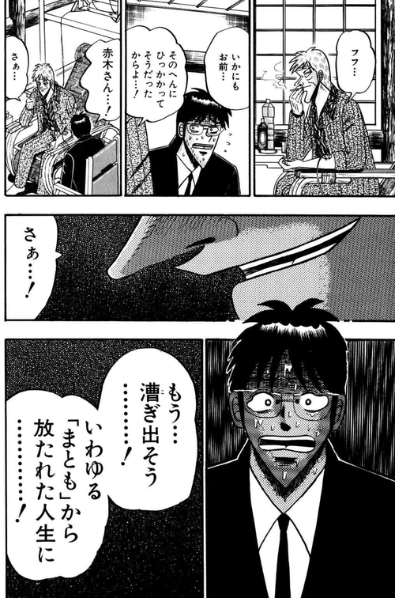

ch2 で扱ったのは、個人の内側の稼働強度だった。熱の純度、成否に囚われない主体、異常な持続力。ここまでは個人で閉じる話だ。

だが、個人の心理OSは孤立して存在しない。集団の中で伝染し、反射し、抑圧される。そして **強い心理OSを持つ個人が組織に入ったとき、必ず何かが壊れる。そして多くの場合、壊れていることにすら気づかれない**。どちらか一方が一方的に壊すのではない。**双方が、双方を壊す**。

本章ではその衝突面を、伝染・切断・破壊・脱出の順で扱う。

---

## 1. 伝染 —— 心理OSは孤立しない

心理OSは、個人の内側の作動状態だが、周囲への放射を止められない。ch2 で触れた「熱」は、言葉や態度や判断を通じて、確実に他人に伝わる。

**強い心理OSは伝染する**。ある人が熱を保ったまま動き続けていると、それを見た人の心理OSも少しずつ動き出す。「この人と話した後は、自分の仕事に戻りたくなる」そういう関係性がある。純度が高いほど、伝染は速い。**熱から生まれた活動同士のシナジー** —— 同じ向きの熱を持つ人たちが出会ったとき、それぞれの熱が独立に燃えていたときよりも、合流した後のほうが大きく燃え上がる瞬間がある。これが組織にとっての真の勝ち筋だ。

ただし、反対側もある。**弱い心理OSも、同じく伝染する**。熱を失った人ばかりの環境にいると、自分の熱もゆっくり下がっていく。**澱みは永遠に澱みのまま** —— 熱・意志なくプロダクトを作り続ける組織は、内部にいる個人の熱も吸い取っていく。

職場・チーム・家族 —— これらは心理OSのプールだ。プール全体の平均温度に、個人の温度は収束しようとする。強い心理OSを保つには、**プールを選ぶ**か、**プール全体を動かす**か、**プールと切れる**か、のどれかしかない。

## 2. 命は関係ねぇ —— 個人が外側と切れるとき

アカギは、勝負の現場についてこう言う。

> 命は関係ねぇだろ……！ 楽しむじゃないか、それだけだ

アカギの勝負は、生き延びるための駆け引きではない。楽しむこと、**その行為そのものが目的**であって、結末にはない。命すら、勝負の外側にある飾りだ。

これは極端な例だが、強い心理OSが組織に入ったときの感覚と地続きだ。命という最も根源的な駆動ですら切断できる人にとって、組織の評価・所属の正当化・順位の確保といった外側の駆動を手放すのは、むしろ容易い。

組織の中にいる、だが **組織から切れている**。組織のルールや期待や成功パターンを理解した上で、それらを動力源としては使わない。

組織依存で動く人は、組織の温度に同期する。組織が熱いときは熱く、組織が冷たくなれば冷たくなる。組織から切れて動く人は、組織の温度とは独立に、自分の温度で動き続ける。

**切れた個人だけが、組織を外から見ることができる**。組織依存の人には、組織の内側しか見えない。「ここではこう動くものだ」という了解が、視界の限界になる。切れた個人は、「この組織がこう動いているのは偶然であって、こう動かないこともあり得る」という外側の視点を持てる。

この切断は、強い心理OSの必要条件だ。切れていない個人は、組織が壊れれば一緒に壊れる。**本当に強い心理OSは、アカギが命を切ったように、組織との癒着からも身軽でいられる**。

## 3. 組織が壊すもの —— 熱を削る構造の正体

強い心理OSが組織に入ると、最初に起きるのは **個人側の摩耗** だ。外から見ると、なぜか元気だった人が少しずつ疲れ、動かなくなり、最後には沈黙する。組織は何もしていないのに、個人の熱は削られていく。

この削られ方には、見覚えのある類型がある。

### 3-1. 症状 —— 見覚えのある類型

**モグラ叩き式対応**。ある問題が起きる、そこだけ直す。別の問題が起きる、そこだけ直す。全体構造は触らない。理由は **全体構造を触る判断のコストが高すぎるから**。結果、パッチだけが増え、構造は歪み続ける。

**独自実装で完全回避**。共通化すれば保守が楽だが、共通化には意思決定のコストがかかる。そこで **共通化を全部諦めて、それぞれ独自実装で逃げる**。短期的には動く。長期的には、誰も全体を理解できない巨大な塊ができる。

**人間を死ぬほど投入して解決**。構造的な問題を、人数で踏み潰す。一人あたりの負荷が上がる。ただし動くことは動く。そして、**動いた結果によって「この方法は正しい」と証明されてしまう**。次も同じことが起きる。

これらに共通するのは何か。**「絵」の喪失** だ。

何を作っているのか、なぜ作っているのか、どこに向かっているのか —— この全体像が見えなくなっている状態で動き続けること。**絵なき活動からは熱も消える**。熱は行為そのものだが、行為に意味が載らなければ純度を保てない。

### 3-2. 機序 —— レイヤー単独の決定

ではなぜ、組織はこんな状態に陥るのか。悪意があるわけではない。**問題は複雑に見えるが、起きていることは単純だ**。各レイヤー(原理層・構造層・実装層)は、それぞれの中では正しく動いている。問題は、その決定が他層に届くまでの経路で変換されないことだ。

構造駆動エンジニアリング組織論は、この機序を「レイヤー単独の決定は他層の火を消しやすい」として扱っている。

> 各レイヤー単独の意思決定は、本人たちにとっては正しい。間違っているのは、他層へ届くまでの経路で変換されていないこと。変換がないと、一方の正しい決定は、他方の火を消す形で受け取られる。

具体的には、こう起きる。原理層が戦略の転換を決める。それは原理層の中では合理的だ。だが変換されずに実装層に下りると、「半年かけて作ってきたものが捨てられる」「自分の判断は組織に必要とされていなかった」と届く。火が消える。

逆方向もある。実装層が「この設計は破綻する」と声を上げる。実装層の中では正当な懸念だ。だが変換されずに原理層に届くと、「エンジニアが文句を言っている」「またネガティブな話か」と処理される。声を上げた本人の火が消え、次に声を上げる人もいなくなる。

**みんな悪意なく頑張っているのに、なぜか前に進まない** —— 多くの組織で見られるあの状態の正体は、ほぼ確実にこれだ。

### 3-3. 個人の側からは発信源が見えない

この機序は、個人の内側からは見えにくい。見えるのは、**自分の熱が削られていくこと** だけだ。発信源は特定できない。「誰かが悪い」のでもない。「組織文化がおかしい」のでもない。ただ、動いているのに熱が上がらない、何をしても純度が保てない、という感覚だけが残る。

これは ch1 で扱った「崩れは音もなく始まる」の **組織版** だ。個人の崩れは自分で見えにくい。組織の崩れも、その中にいる個人からは見えにくい。気づいたときには、すでに削られている。

### 3-4. そしてスタートアップの 9 割は死ぬ

このメカニズムは、個人やチーム単位に留まらない。組織全体に拡張されたとき、最終的に現れるのが「死」だ。

**真面目に固くやっても、行き着く道は 9 割死**。これはスタートアップの統計的事実だが、機序としても説明できる。個々のレイヤーが単独で合理的な決定を積み重ね、変換されずに他層の火を消し続け、全体として熱が落ちていく。動いているのに進まない。やがて死ぬ。

覆すのは熱しかない。**ただし、個人の熱だけでは覆せない**。組織が個人の心理OSを保護できない構造のままでは、どれだけ強い個人が入ってきても、順番に削られていく。

## 4. 個人が壊すもの —— 強い心理OSが組織に落とす歪み

ここまでは、組織が個人を壊す方向の話だ。だが、衝突は双方向だ。強い心理OSを持つ個人もまた、組織を壊す。

**弱い合意を拒否する**。強い心理OSの人は、全員の顔色を見て落とした妥協案に乗れない。「これで進めましょう」という合意の熱が低すぎると、そこに同意できない。結果、会議が長引き、合意形成が遅れ、周囲から見ると **扱いにくい人** になる。

**へこたれる人の気持ちが分からない**。ch2 §5 で扱った通り、強い心理OSは弱い心理OSの状態を体感として共有できない。これが組織運営に直撃する。「なぜこのメンバーが動かないのか」の体感的理解がないと、引き上げ方も待ち方も分からない。**共感の線が切れている**ところでは、統率は働かない。

**伝染が二極化を生む**。強い心理OSを持つ個人の周囲に、同じ強度の人が集まる。その一方で、その外側にいる人たちは、「ついていけない」と感じて離れていく。組織の中に「熱いクラスター」と「冷えた外側」ができ、両者の間の分断が深まる。

これらは、強さの副作用だ。強い心理OSは優しくない。**組織の平均的な動きを、確実に揺らす**。揺らされた側から見れば、それは「壊された」と感じる。

## 5. 漕ぎ出そう —— 個人が組織を抜ける瞬間

組織の中で心理OSが削られ続け、個人がそれを認識した瞬間、アカギの一節が浮かぶ。

> もう……漕ぎ出そう……！
> いわゆる「まとも」から放たれた人生に……！

組織の「まとも」から抜ける瞬間だ。「ここでのやり方」「この組織の常識」「期待される役割」—— すべて手放して、自分の熱の方向に漕ぎ出す。

これは必ずしも退職のことではない。組織に所属したままでも、**組織の基準では動かない**ことを自分に許す瞬間のことだ。あるいは、本当に退職することもある。どちらにせよ、内側で起きるのは同じ決断だ。**自分の心理OSが削られ続けるのを止める**という決断。

抜けない選択もある。組織の中に残って、削られながらも熱を再生産し続ける道。これは短期的には可能だが、長期的には消耗する。「抜けない強さ」が成立するのは、**組織側が心理OSの保護をしてくれているときだけ**だ。

では、組織が心理OSを保護するとはどういうことか。個人が強くあるだけでは足りない。**組織の構造そのものが、熱を削らない設計になっている**こと。そんな組織は作れるのか。これが次章の問いだ。

## 終わりに —— ch4 への橋

個人の心理OSは、組織に接続されたとき、必ず衝突する。

組織は、レイヤー単独の決定が変換されないまま積み重なり、個人の熱を削る。個人は、強さの副作用として、組織の平均的な動きを揺らす。双方向の破壊が、放っておけば淡々と進行する。

この衝突を、個人の強さだけで受け止めるのは持続しない。構造の側も動かす必要がある。**組織が、個人の心理OSを削らない設計**を持てるか。これは組織論の問題だ。

次章では、外側(構造駆動)と内側(心理OS)がどう噛み合えば、衝突の中でも熱が保たれるかを扱う。
