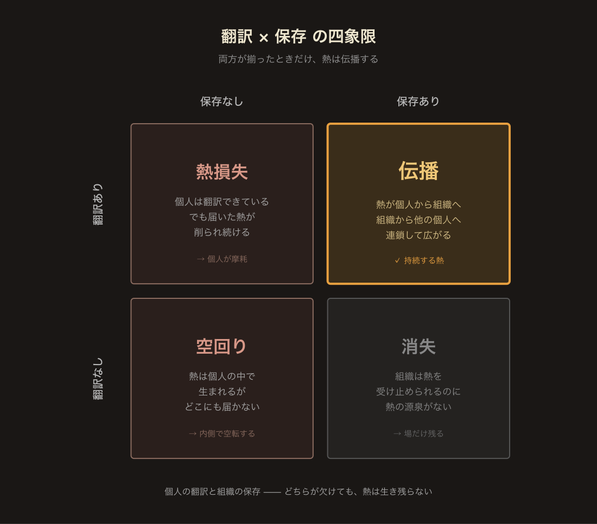
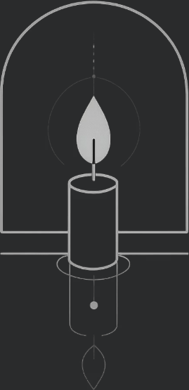

ch3 で扱ったのは、個人と組織が衝突したときに何が起きるかではない。**なぜ必ず壊れるのか、その機序** だ。結論はこうだ —— **構造が変わらない限り、強さは必ず削られる**。

これは性格の問題でも、努力の問題でもない。**構造でしか解決しない**。本章はその構造を扱う。答えはひとつではなく、**個人側と組織側の双方**に要る。片方だけでは保たない。噛み合って初めて動く。

本章で扱う 2 つの所作を、**翻訳** と **保存** と呼ぶ。翻訳は個人側の所作 —— 自分の熱を、組織に届く形に変える技法。保存は組織側の設計 —— 熱を削らない構造を作る設計。この 2 つが同時に存在するときだけ、ch3 で見た双方向の破壊は止まる。

---

## 1. 問い —— 越えられるか

ch3 で示した機序を、もう一度短く置き直す。組織は、レイヤー単独の決定が変換されないまま積み重なり、個人の熱を削る。個人は、強さの副作用として組織の平均的な動きを揺らす。双方向の破壊が、放っておけば淡々と進行する。

ここで選択肢は三つある。

一つ目は **抜ける** —— ch3 §5 で扱った「漕ぎ出そう」。組織を離れ、自分の熱の方向に移動する。

二つ目は **削られ続ける** —— 気づいていながら抜けられない場合、純度は下がり、やがて心理OSは停止する。

三つ目が、本章の問いだ。**噛み合わせる**。衝突を前提にしながら、それでも熱を保って動き続ける構造を、個人側と組織側の双方から設計する。

噛み合わせは、抜けるより難しい。漕ぎ出すのは一度の決断だが、噛み合わせは日々の実践だ。ただし、噛み合ったときの熱の伝播量は、抜けたときの比ではない。熱が個人のものから組織のものに広がり、組織から他の個人へ、そしてまた組織へと連鎖していく。この連鎖を作れるかどうかが、持続する強さの本体だ。

## 2. 個人の所作 —— 熱を届ける技法

強い心理OSを持つ個人が組織に入ったとき、熱の純度が高ければ自動的に届くわけではない。届かせるには、**外側から見える形に翻訳するしかない**。翻訳されない熱は、存在しないのと同じだからだ。翻訳は 2 段に分かれる。

### 2-1. 証明フェーズ —— 信頼が通るまで動けない

組織に新しく入った個人が、いきなり自分の原理で動こうとすると、ほぼ確実に弾かれる。原理がどれだけ正しくても、**信頼が通っていないうちは、正しさが届かない**。**証明されていない強さは、組織の中では存在していない**。

ここで通らないといけないのが **証明フェーズ** だ。スポーツの世界で、エースが取って代わるときや、戦術が変わるときに、中心人物が必ず超えている期間のことだ。証明対象は複数層ある。

- **プレーの確実性** —— 見えているだけでなく、手元で再現できるか
- **作戦の実効性** —— その原理で動くと、結果が出せるか
- **チームとの馴染み** —— 人格が組織に溶ける速度
- **未来を賭けるに足るか** —— 一時の調子ではなく、長期に懸けられる芯があるか

これらの証明を飛ばした強さは、どれだけ純度が高くても、組織の中では浮く。原理を語る前に、**まず結果と整合を見せる**。それが証明フェーズの仕事だ。

証明フェーズは熱を削る期間ではない。**熱を翻訳する期間**だ。自分の原理を、組織が読める形 —— 結果・関係・時間 —— に変換して提示する。これを通った後で、初めて自分の原理で動ける。

証明を通らずに原理だけ推し進めた強さは、組織に届かないまま消える。ch3 §4 で扱った「強い個人が組織に落とす歪み」が、ここに効く。翻訳を挟まなければ、強さは衝突しか生まない。

### 2-2. 証明フェーズの二つの型 —— 即時型と浸透型

証明フェーズ自体に、二つの型がある。[git 履歴の実観測](https://library.orbitlens.io/git-archaeology/#ch5)から、エンジニアがアーキテクトへ進化するときに確認された 2 つの所作だ。

**即時型** —— 短い [Anchor 期](https://library.orbitlens.io/git-archaeology/#ch3)の後、すぐに自分のアーキテクチャで設計を開始する。速い。だが、先代の構造との連続性が切れるため、**チームとの衝突リスク**が高い。

**浸透型** —— 先代の構造を尊重し、生産しながら徐々に自分の設計を浸透させる。Anchor 期で既存構造を理解し、Producer 期で大量生産しながら、その過程で自分のアーキテクチャが徐々にコードベースに浸透していく。時間はかかるが、**既存構造との連続性が保たれる**。

**どちらが優れているかは、現場の温度で決まる**。

- **凝り固まった保守的な環境** —— 浸透型は時間がかかりすぎて、途中で熱が消耗する。**十分な「壊す権限」を与えた即時型** の方が成果が出やすい。
- **すでに高い熱量で動いている現場** —— そこにあるベクトルを整えるだけでいい。浸透型の方が摩擦が少なく、結果も残りやすい。

どちらの型でも、目的は同じ —— **押し付けではなく、伝播**。違うのは速度と、相手の温度との噛み合わせ方だ。

ここで ch3 §2 の「才能とか命は関係ねぇ」と矛盾するのでは、と思うかもしれない。組織から切れているのに、組織に浸透させる? 矛盾ではない。**内側で組織から切れていることと、外側で浸透的に振る舞うことは、同時に成り立つ**。切断は動力源の話、浸透は所作の話だ。

切断していない人は、組織の温度に同期してしまって、そもそも浸透させるべき自分の原理を持たない。切断している人だけが、浸透させる原理を持てる。その上で、外側の所作を浸透型に選ぶ。**翻訳されない強さは、組織に届かない**。

翻訳は、**小射程な純度ほど難易度が高い**(ch2 §4)。craft レベルの深い執着 —— 良い UX、特定の実装の精度 —— は、組織が受け取れる形に変換するとき、その細かさ自体を運ばなければならない。丸めて一般化すれば届かなくなる。ここで §3-1 の変換者の **美学の共感** が最も効く。複数レイヤーの美学に触れている人だけが、小射程な純度の具体性を潰さずに層を超えて運べる。

## 3. 組織の設計 —— 熱を削らない構造

個人側が翻訳を担っても、組織側が熱を削り続ける構造のままでは、翻訳は徒労に終わる。組織側にも、**熱を保存する** 設計が要る。**保存のない組織では、どれだけ届けられた熱もすぐに蒸発する**。保存は 2 層に分かれる。

### 3-1. レイヤー変換者の配置

ch3 §3-2 で扱った「レイヤー単独の決定は他層の火を消す」機序の、逆設計がここに来る。

各レイヤー(原理層・構造層・実装層)が、それぞれの中で正しい決定をしても、変換されないまま他層に届けば熱を消す。ならば、**変換者を明示的に配置する** のが組織設計の核だ。

変換者は、中間管理職の別名ではない。**変換のプロ**だ。原理層の戦略転換を、実装層が「自分たちの仕事の延長」として受け取れる言葉に変換する。実装層の「この設計は破綻する」という声を、原理層が「戦略の再考材料」として受け取れる構造に変換する。

変換者に要る資質は三つある。

**美学の共感** —— 各レイヤーには固有の美学がある。原理層には戦略のエレガンス、構造層には設計の簡潔さ、実装層にはコードの気持ちよさ。変換者は、自分の本拠でないレイヤーの美学にも心から共感できなければならない。**共感なき翻訳は、文字通りに正しくても、その層の熱を運ばない**。

**履歴を読める力** —— 各レイヤーの決定には、そこに至るまでの歴史がある。なぜ今の設計になったか、どの判断が効いて、どれが残ったか。履歴を読めない変換者は、表層の内容しか変換できない。**深い文脈を運ばない翻訳は、受け取った側で拒絶される**。

**思想者型の姿勢** —— アドラー心理学には「思想者」と「哲学者」の対比がある。**思想者**は問いを置き、相手が自分で答えに辿り着くのを待つ。**哲学者**は答えを持ち込み、正しさを示す。変換者に要るのは思想者の姿勢だ。哲学者型の変換は「正しい翻訳」を押し付けるが、押し付けられた層では熱は生まれない。受け手の層が自分の言葉で原理に辿り着ける問いを設計すること —— それが、層を跨いで熱を運ぶ主な経路になる。

『アオアシ』の福田達也監督がわかりやすい。彼は選手に戦術を直接指示しない。「なぜそこにいた？」「なぜそのパスを選んだ？」と問い続け、選手の頭の中で戦術が組み上がるのを待つ。答えは福田の側にあるのに、先に言わない。選手が自分の言葉で辿り着いた瞬間、その戦術理解は **選手自身の熱** になる。変換者の仕事は、同じ構造を持つ。

ただし、福田監督も、選手起用や戦術決定ではトップダウンで判断を下す。そこでは問いを投げている時間が、組織の目的と合わなくなるからだ。変換者も同じだ。**組織と熱の回転効率、達成したい目的のあいだで、哲学者型が最適解になる瞬間は確かにある**。原則は思想者型、必要な瞬間だけ哲学者型 —— その使い分けこそが、思想者型の姿勢の完成形だ。

この三つを持つ変換者は、中間管理職でも技術通訳でもない。**複数レイヤーの美学に触れ、歴史を読み続け、層の熱を問いの形で運ぶ専門職** だ。

変換がある組織では、各層の正しい決定が他層の火を消さない。むしろ、**正しい決定が他層の熱を点ける** こともある。**変換者が存在しない組織では、正しい決定ですら熱を消す**。**組織全体のエネルギーは、意思決定の正しさではなく、変換の密度で決まる**。変換者のいない組織は、どれだけ優秀な個人がいても、必ず熱を失う。

### 3-2. 変換者のキャリアパス

三つの資質すべてを初めから備えて現れる変換者はいない。そこにも段階がある。

アオアシのフィールドを、組織の三層に重ねると見えやすい。フィールドの中で起きる一手一手 —— パス、動き出し、寄せ —— は、**実装層**の動きだ。その外側、ベンチやスタッフが設計する戦術・トレーニングは**構造層**、クラブの思想や「このチームは何を信じてプレーするのか」は**原理層**にあたる。実装層は身体が動く場、構造・原理層はその動きを支える設計と思想の側だ。

『アオアシ』の大友がわかりやすい。彼の本拠はフィールド —— 実装層 —— にある。プレーヤーとして現場で実行し続ける立場だ。そのうえで彼は、福田監督の戦術的意図 (構造層) と、チームが何を目指すか (原理層) を理解している。だから実装層の中で、攻撃と守備のあいだを水のように繋げる。**上の層に触れた実装層のプレイヤー** —— これは良い変換者の姿だ。ただし、福田監督が選手起用や戦術決定で差し挟むような、哲学者型への切り替えまでは、まだ習得途中に見える。

変換者の難しさは、**自分が立つ層を極めながら、同時にその流れを他の層に繋ぐこと** に集まる。

**変換者の本拠は、どの層にあってもいい**。福田監督のようにフィールド外側 (構造層・原理層) から層を跨いで繋ぐ人もいれば、大友のように実装層にいながら上の層に手を届かせて繋ぐ人もいる。本拠がどこでも、変換者として成立する。自分の層にどれだけ軸足を残し、他の層にどれだけ越境するか —— **それもまたバランス**だ。

そのうえで、**フィールドでプレーしている人が原理層に触れられることの意味は特別に大きい**。肌で感じる密度と、現場で発揮している実力が同時に乗るからだ。「自分も同じフィールドに立ちながら、原理にも触れている」という構造は、**説得力の伝播にとても効く**。実装層で実際に結果を出しながら、上の層の意図まで語れる人がひとりいるだけで、組織全体の熱の循環が一段変わることがある。

**このバランスには、おそらく黄金比のようなものがある**。自分のプレーに集中しすぎれば他層への翻訳が痩せ、翻訳に集中しすぎれば自分の層での動きが濁る。その間にある最適点を探り続けること自体が、変換者のキャリアなのかもしれない。

### 3-3. 制御されたカオス

変換者が **熱を消さない経路** を確保する第一の設計だとすれば、もう一つの設計は **熱が生まれる場** を確保することだ。構造の中に **熱が保存される場** を戦略的に作る。

各々が好き勝手に動けば、全体はただのカオスになる。だが、完全に統率された組織は熱を生まない。必要なのは、**理外の一手を許す枠内を、戦略的に作る** ことだ。

枠の内側では、職種や役職は関係ない。枠内だけで必要な機能が完結する。この中では、熱のある動きしか起こらない。熱のない動きには人が集まらないからだ。熱は、「今ある構造を直す」からでも、「大きな新機能を作る」からでも、「既存の何かを壊す」からでも、**なんでも発生しうる**。

ただし、この枠が完全な放任カオスになれば、破滅に向かう。枠には **観測・限定・連動** の 3 条件が要る。

- **観測** —— 枠の中で何が起きているかが、外から見えること
- **限定** —— 枠がどこまで拡張してよいかの境界が明示されていること
- **連動** —— 枠の中の動きが、組織全体の他の構造と噛み合う経路を持つこと

この 3 条件が揃った枠こそが、**熱を保存する場** だ。ch3 §1 で触れた「熱から生まれた活動同士のシナジー」は、こういう枠の中でしか、本当には動かない。

### 3-4. 保存が消さないようにする熱

保存の対象は、大射程な熱を持つ個人だけではない。むしろ切実なのは、ch2 §4 で扱った **小射程な純度** —— UX への深い執着、コードの美学、精度へのこだわり —— を持つ人たちの熱だ。方向は正しくとも実現経路が細く、外圧に直撃されやすい。変換者と制御されたカオスは、**小射程な熱が独りで燃え尽きない迂回路と共鳴の場** を用意する仕事でもある。大射程な人は自分で熱を持たせ続けられる。小射程の人の火を消さないことが、保存の中核的な存在理由の一つだ。

## 4. 整合の条件 —— 噛み合うとき

翻訳(個人側)と保存(組織側)は、片方だけでは成立しない。下の四象限が示すように、どちらかが欠けるとそれぞれ固有の失敗モードに落ちる。熱が生き残るのは、**両方が揃った右上のセルだけ** だ。

- **翻訳あり × 保存なし** → 届いた熱が削られ続け、個人が摩耗する(**熱損失**)
- **翻訳なし × 保存なし** → 熱は個人の中で生まれるが、外に届かず空転する(**空回り**)
- **翻訳なし × 保存あり** → 組織の場は整っているが、熱の源泉がない(**消失**)
- **両方あり** → 熱が個人から組織へ、組織から他の個人へ連鎖して伝播する(**伝播**)

**2 つが同時に存在するときだけ、熱は伝播する**。個人は自分の熱を外側に届く形に翻訳し、組織は届いた熱を削らない場を用意する。この対応が成立した瞬間に、ch3 §1 で扱った伝染の中で最も価値のある形 ——「熱から生まれた活動同士のシナジー」——が、実際に動き出す。

噛み合うとは、個人が組織を支配することでも、組織が個人を所有することでもない。**両者が対等に、相手の温度を削らずに、自分の温度を届ける**。**一方が他方を従属させた瞬間、この整合は崩れる**。この対等の条件が揃ったとき、組織は個人を超えた熱の伝播装置になる。

整合は **射程を跨いで機能する** (ch2 §4)。大射程な熱は翻訳を通じてそのまま層を超え、伝播する。一方、小射程な純度は単一ターゲットへ直接伝播しにくい。だが **共鳴** で広がる —— 複数の craft レベル執着が同じ保存空間に入り、互いの熱を反射し合って共有された動きになる。『ブルージャイアント』のセッションがその典型だ。大射程は届け、小射程は共鳴する。どちらも整合の中でしか起こらない。

## 5. 終わりに —— 強さは、ひとりでは持続しない

本編を閉じる。

ch0 で、心理OSを定義した。外部の成功・正論・空気に上書きされず、自分の意思で動き続ける状態を保つための作動原理。熱を明け渡さないこと。

ch1 で、観測を扱った。自分の心理OSは自分では見えにくい。補助線を意図的に持ち、過去の自分と対話し、他者の反射を借りて、崩れに気づく。**気づいたら戻る**。

ch2 で、強い状態を扱った。純度・反応速度・再起動力。成否に囚われず、主体を自分に置き、崩れても戻り続ける。強さは完璧さではなく、戻れることだ。

ch3 で、組織との衝突を扱った。個人の心理OSは閉じていない。組織は、正しい決定の経路が切れれば熱を削る。個人は、強さの副作用で組織を揺らす。双方が、双方を壊す。**漕ぎ出す**か、**削られ続ける**か、あるいは ——

ch4 で、噛み合わせを扱った。個人は熱を **翻訳** し、組織は熱を **保存** する。2 つが噛み合ったとき、熱は個人から組織へ、組織から他の個人へ、連鎖して伝播する。

これが、心理OSという内側の原理の全体像だ。構造駆動が外側の物理を担うのに対し、本書は内側の原理を扱った姉妹編である。どちらか一方では足りない。**内側と外側が両方とも動くときだけ、持続可能な強さが生まれる**。

---

最後にひとつだけ書いておく。

**強さは、ひとりでは持続しない**。自分の熱を翻訳し、他者の熱を削らない場を選び、そしてその場を育てる。**二重設計とは、熱を失わずに拡張するための唯一の構造だ**。

熱だけは、誰にも明け渡してはいけない。だが、熱はひとりでは燃え続けない。明け渡さないまま、伝播する。この難しさと向き合うことこそ、心理OSという原理の **本領** だ。

**熱は一人で生まれるが、構造の中でしか生き残らない**。
