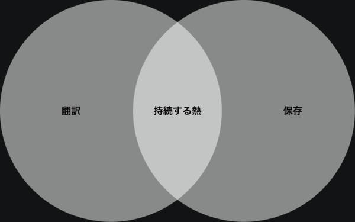

ch3 は、個人の心理OSと組織の構造が接続されたときに、必ず何かが壊れるという話だった。結論はこうだ —— **この衝突は、個人の強さだけでは越えられない。構造の側を変えなければ、全員が順番に削られていく**。

では、どう設計すれば越えられるのか。本章はその問いに答える。答えはひとつではなく、**個人側と組織側の双方**に要る。片方だけでは保たない。噛み合って初めて動く。

本章で扱う 2 つの所作を、**翻訳** と **保存** と呼ぶ。翻訳は個人側のムーブ —— 自分の熱を、組織に届く形に変える技法。保存は組織側の設計 —— 熱を削らない構造を作る設計。この 2 つが同時に存在するときだけ、ch3 で見た双方向の破壊は止まる。

---

## 1. 問い —— 越えられるか

ch3 で示した機序を、もう一度短く置き直す。組織は、レイヤー単独の決定が変換されないまま積み重なり、個人の熱を削る。個人は、強さの副作用として組織の平均的な動きを揺らす。双方向の破壊が、放っておけば淡々と進行する。

ここで選択肢は三つある。

一つ目は **抜ける** —— ch3 §5 で扱った「漕ぎ出そう」。組織を離れ、自分の熱の方向に移動する。

二つ目は **削られ続ける** —— 気づいていながら抜けられない場合、純度は下がり、やがて心理OSは停止する。

三つ目が、本章の問いだ。**噛み合わせる**。衝突を前提にしながら、それでも熱を保って動き続ける構造を、個人側と組織側の双方から設計する。

噛み合わせは、抜けるより難しい。漕ぎ出すのは一度の決断だが、噛み合わせは日々の実践だ。ただし、噛み合ったときの熱の伝播量は、抜けたときの比ではない。熱が個人のものから組織のものに広がり、組織から他の個人へ、そしてまた組織へと連鎖していく。この連鎖を作れるかどうかが、持続する強さの本体だ。

## 2. 個人のムーブ —— 熱を届ける技法

強い心理OSを持つ個人が組織に入ったとき、熱の純度が高ければ自動的に届くわけではない。届かせるには、**外側から見える形に翻訳するしかない**。翻訳されない熱は、存在しないのと同じだからだ。翻訳は 2 段に分かれる。

### 2-1. 証明フェーズ —— 信頼が通るまで動けない

組織に新しく入った個人が、いきなり自分の原理で動こうとすると、ほぼ確実に弾かれる。原理がどれだけ正しくても、**信頼が通っていないうちは、正しさが届かない**。

ここで通らないといけないのが **証明フェーズ** だ。スポーツの世界で、エースが取って代わるときや、戦術が変わるときに、中心人物が必ず超えている期間のことだ。証明対象は複数層ある。

- **プレーの確実性** —— 見えているだけでなく、手元で再現できるか
- **作戦の実効性** —— その原理で動くと、結果が出せるか
- **チームとの馴染み** —— 人格が組織に溶ける速度
- **未来を賭けるに足るか** —— 一時の調子ではなく、長期に懸けられる芯があるか

これらの証明を飛ばした強さは、どれだけ純度が高くても、組織の中では浮く。原理を語る前に、**まず結果と整合を見せる**。それが証明フェーズの仕事だ。

証明フェーズは熱を削る期間ではない。**熱を翻訳する期間**だ。自分の原理を、組織が読める形 —— 結果・関係・時間 —— に変換して提示する。これを通った後で、初めて自分の原理で動ける。

証明を通らずに原理だけ推し進めた強さは、組織に届かないまま消える。ch3 §4 で扱った「強い個人が組織に落とす歪み」が、ここに効く。翻訳を挟まなければ、強さは衝突しか生まない。

### 2-2. 浸透型の振る舞い

証明フェーズを通った後、次に選べるのは二つの所作だ。git 履歴の実観測から、エンジニアがアーキテクトへ進化するときに 2 つの型が確認されている。

**即時型** —— 短い Anchor 期の後、すぐに自分のアーキテクチャで設計を開始する。速い。だが、先代の構造との連続性が切れるため、**チームとの衝突リスク**が高い。

**浸透型** —— 先代の構造を尊重し、生産しながら徐々に自分の設計を浸透させる。Anchor 期で既存構造を理解し、Producer 期で大量生産しながら、その過程で自分のアーキテクチャが徐々にコードベースに浸透していく。時間はかかるが、**既存構造との連続性が保たれる**。

どちらが正しいという話ではない。ただ、強い心理OSを持つ個人が組織と衝突を避けながら熱を届けるには、浸透型の方が摩擦が少ない。熱を **押し付ける** のではなく、**伝播させる**。

ここで ch3 §2 の「才能も命も関係ねぇ」と矛盾するのでは、と思うかもしれない。組織から切れているのに、組織に浸透させる? 矛盾ではない。**内側で組織から切れていることと、外側で浸透的に振る舞うことは、同時に成り立つ**。切断は動力源の話、浸透は所作の話だ。

切断していない人は、組織の温度に同期してしまって、そもそも浸透させるべき自分の原理を持たない。切断している人だけが、浸透させる原理を持てる。その上で、外側の所作を浸透型に選ぶ。**翻訳されない強さは、組織に届かない**。

## 3. 組織の設計 —— 熱を削らない構造

個人側が翻訳を担っても、組織側が熱を削り続ける構造のままでは、翻訳は徒労に終わる。組織側にも、**熱を保存する** 設計が要る。**保存のない組織では、どれだけ届けられた熱もすぐに蒸発する**。保存は 2 層に分かれる。

### 3-1. レイヤー変換者の配置

ch3 §3-2 で扱った「レイヤー単独の決定は他層の火を消す」機序の、逆設計がここに来る。

各レイヤー(原理層・構造層・実装層)が、それぞれの中で正しい決定をしても、変換されないまま他層に届けば熱を消す。ならば、**変換者を明示的に配置する** のが組織設計の核だ。

変換者は、中間管理職の別名ではない。**変換のプロ**だ。原理層の戦略転換を、実装層が「自分たちの仕事の延長」として受け取れる言葉に変換する。実装層の「この設計は破綻する」という声を、原理層が「戦略の再考材料」として受け取れる構造に変換する。

変換がある組織では、各層の正しい決定が他層の火を消さない。むしろ、**正しい決定が他層の熱を点ける** こともある。変換者がいない組織では、同じ決定が火を消す。組織全体の熱の総量は、**変換者の存在密度で決まる**。変換者のいない組織は、どれだけ優秀な個人がいても、必ず熱を失う。

### 3-2. 制御されたカオス

もう一つの層は、構造の中に **熱が保存される場** を戦略的に作ることだ。

各々が好き勝手に動けば、全体はただのカオスになる。だが、完全に統率された組織は熱を生まない。必要なのは、**理外の一手を許す枠内を、戦略的に作る** ことだ。

枠の内側では、職種や役職は関係ない。枠内だけで必要な機能が完結する。この中では、熱のある動きしか起こらない。熱のない動きには人が集まらないからだ。熱は、「今ある構造を直す」からでも、「大きな新機能を作る」からでも、「既存の何かを壊す」からでも、**なんでも発生しうる**。

ただし、この枠が完全な放任カオスになれば、破滅に向かう。枠には **観測・限定・連動** の 3 条件が要る。

- **観測** —— 枠の中で何が起きているかが、外から見えること
- **限定** —— 枠がどこまで拡張してよいかの境界が明示されていること
- **連動** —— 枠の中の動きが、組織全体の他の構造と噛み合う経路を持つこと

この 3 条件が揃った枠こそが、**熱を保存する場** だ。ch3 §1 で触れた「熱から生まれた活動同士のシナジー」は、こういう枠の中でしか、本当には動かない。

## 4. 整合の条件 —— 噛み合うとき

翻訳(個人側)と保存(組織側)は、片方だけでは成立しない。

翻訳はあっても保存がない組織では、翻訳された熱も削られる場にそのまま流し込まれ、個人は摩耗する。保存はあっても翻訳がない組織では、熱の源泉になる個人がいないので、場だけがあって熱が通らない。

**2 つが同時に存在するときだけ、熱は伝播する**。個人は自分の熱を外側に届く形に翻訳し、組織は届いた熱を削らない場を用意する。この対応が成立した瞬間に、ch3 §1 で扱った伝染の中で最も価値のある形 ——「熱から生まれた活動同士のシナジー」——が、実際に動き出す。

噛み合うとは、個人が組織を支配することでも、組織が個人を所有することでもない。**両者が対等に、相手の温度を削らずに、自分の温度を届ける**。**一方が他方を従属させた瞬間、この整合は崩れる**。この対等の条件が揃ったとき、組織は個人を超えた熱の伝播装置になる。

## 5. 終わりに —— 強さは、ひとりで保つものではない

本編を閉じる。

ch0 で、心理OSを定義した。外部の成功・正論・空気に上書きされず、自分の意思で動き続ける状態を保つための作動原理。熱を明け渡さないこと。

ch1 で、観測を扱った。自分の心理OSは自分では見えにくい。補助線を意図的に持ち、過去の自分と対話し、他者の反射を借りて、崩れに気づく。**気づいたら戻る**。

ch2 で、強い状態を扱った。純度・反応速度・再起動力。成否に囚われず、主体を自分に置き、崩れても戻り続ける。強さは完璧さではなく、戻れることだ。

ch3 で、組織との衝突を扱った。個人の心理OSは閉じていない。組織は、正しい決定の経路が切れれば熱を削る。個人は、強さの副作用で組織を揺らす。双方が、双方を壊す。**漕ぎ出す**か、**削られ続ける**か、あるいは ——

ch4 で、噛み合わせを扱った。個人は熱を **翻訳** し、組織は熱を **保存** する。2 つが噛み合ったとき、熱は個人から組織へ、組織から他の個人へ、連鎖して伝播する。

この全体が、心理OSという内側の原理の射程だ。構造駆動が外側の物理を担うのに対し、本書は内側の原理を扱った姉妹編である。どちらか一方では足りない。**内側と外側が両方とも動くときだけ、持続可能な強さが生まれる**。

---

最後にひとつだけ書いておく。

強さは、ひとりで保つものではない。自分の熱を翻訳し、他者の熱を削らない場を選び、そしてその場を育てる。**二重設計とは、熱を失わずに拡張するための唯一の構造だ**。

熱だけは、誰にも明け渡してはいけない。だが、熱はひとりでは燃え続けない。明け渡さないまま、伝播させる。この難しさと向き合うのが、心理OSという原理の、本当の射程だ。
