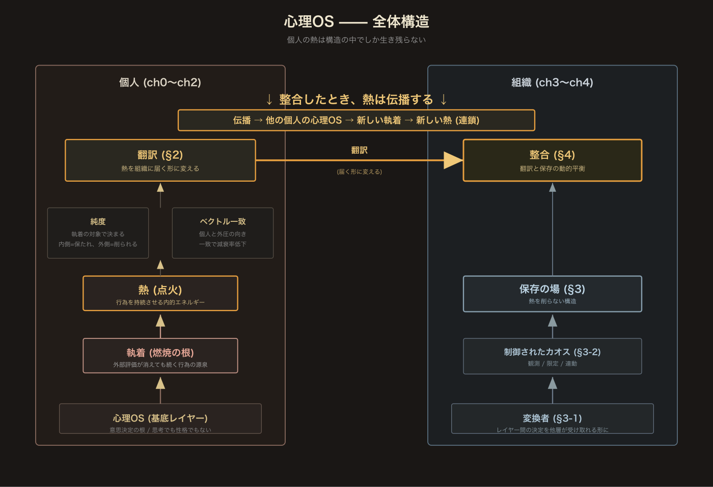

本編を読み終えた人向けの短い付録として、この体系が二重構造(構造駆動 × 心理OS)になった経緯を書いておく。興味のある人だけ読めばいい。

その前に、本書全体の構造を一枚の図にまとめておく。

左側が個人 (ch0〜ch2) の作動原理。心理OSが基底にあり、執着が源泉になって熱が点火し、純度とベクトルが熱の質を決め、翻訳として外に出る。右側が組織 (ch3〜ch4) の設計。変換者と制御されたカオスが保存の場を作り、整合が動的平衡として成立する。両者が噛み合ったときだけ、熱は伝播し、他の個人の心理OSを点火する。

---

## 原理は、すぐ汚染される

強い原理に触れたとき、人は無意識にそれを自分の関心領域に引き寄せる。アカギの哲学を読んだエンジニアは組織論に変換し、経営者は戦略論に変換し、芸術家は創作論に変換する。変換することで理解が進むのは確かだが、**変換の瞬間に原理は汚染されている**。元の原理が持っていた広がり —— 職能や領域を選ばず、個人の内側に直接届く強度 —— が失われる。

思想家・創業者・エンジニアリングマネージャーのように、自分の体系を持って物を考える人ほど、この汚染は起きやすい。持ち込む型が強いほど、原理がその型に吸収されやすくなる。

## 失敗した一度目の翻訳

2 年ほど前、所属していた会社に向けて同じ素材でアカギ記事を書いた。当時の私はまさにこの汚染をやっていた。アカギの哲学は本来職能と関係のない**個人の作動原理**の話なのに、自分の組織論に引き寄せて翻訳してしまっていた。結果、文章は「アカギを借りて組織論を強化する」構造になり、本来アカギが持っていた広がりが狭まっていた。

社内の共有文章として書いた。少しでも『構造駆動エンジニアリング組織論』や、『心理OS』の種としての感覚を共有できたのかはわからない。少なくとも、あの伝え方では届かなかった手応えのほうが強い。

## 二度目の翻訳で分けたもの

本編では、この失敗を二つの区分で補正した。

**外側の物理 —— 構造駆動エンジニアリング組織論**

組織や設計を連続場の物理として観測する、個人への帰属を外した記述。これは別体系で続けている。

**内側の作動原理 —— 心理OS**

アカギのような個人の内側の稼働状態を、物理モデルに汚染させずに扱う層。本編はこちらだけを扱い、構造駆動には踏み込まない。

この分離ができたことで、アカギの原理を**アカギのまま尊重する**ことができた。自分の組織論に吸い取らずに済んだ。

## 読み手への含意

もしあなたが何らかの体系を持って世界を見る人なら、強い原理に触れたとき一度立ち止まってほしい。**それは自分の体系を強化するために使っているのか、それとも原理そのものを尊重しているのか**。

原理を原理のまま扱うには、自分の関心領域とは別のレイヤーで一度受け止める必要がある。二重の設計(外側と内側)は、その受け止め方の技法のひとつだ。

## 誰のための本か

本書は特定の職能に向けて書かれていない。エンジニア、研究者、アスリート、ミュージシャン、経営者、親、教師 —— 領域は関係ない。**熱を保ち続けることの難しさは、職能を超えて同じ** だからだ。

『宇宙兄弟』のムッタが宇宙飛行士を目指し続ける姿、『ブルージャイアント』のダイがジャズで世界の頂点を目指す姿 —— どちらも、熱の保ち方の話として読める。彼らが熱く見えるのは、才能でも若さでもなく、**作動原理を手放していない** からだ。本書はその作動原理を言語化した書だ。

熱を失いかけていると感じている人、周囲が同意する成功像への違和感が消えない人、毎日少しずつ芯が削られている感覚がある人 —— どれか一つにでも心当たりがあれば、本書は地図として使える。

### AI 時代の補足

『git考古学』でも『構造駆動エンジニアリング組織論』でも触れてきたが、汎用 AI 以降の人間の仕事は、**熱の純度と方向を立てること** に集約されていく。

これまで、組織の強さは「熱 × 人手・質量・作業量」で決まっていた。純度の高い熱も、頭数と手数なしには物質化しなかった。

AI はその制約 —— 手の多さ、物質的質量、作業量 —— から人間を解き放つ。AI は単純な量産機械ではなく、**純度の高い熱源を伝播しやすくするための触媒** だ。

人間の役割はここで変わる。**熱を立てる** こと、**触媒を駆使しながら組織化する** こと。頭数で賄っていた組織化が、少数の高純度な熱を持つ人間だけで成立するようになる。結果、**少数の、熱を保ち続ける組織** が生まれる素地ができた。

ただし、触媒が効くのは、**熱そのものが明け渡されていない限り** だ。AI が代替するのは翻訳や実装の一部であって、**執着と純度** は置き換えられない。何に執着するかを決め、射程をどこに置くかを選び、外圧の中で熱を保ち続けること —— これが汎用 AI 以降に残る人間の仕事の芯だ。

**人間の可能性を諦める話ではない。上限が上がった話だ**。触媒をうまく使えるのは、心理OSが稼働している人間だけだ。使うだけなら、誰でもできる。

## 自己診断 —— 心理OSチェックリスト

本書の用語を使って、いまの自分と組織の状態を測る。各項目に「はい/いいえ/分からない」で答えて、パターンを見る。

### 個人側 — 熱と執着

1. **直近1週間で、誰にも頼まれていないのに自分から始めた動きがあったか?**
   ない → 熱量が停止、外圧駆動に傾いている可能性
2. **いま何に執着しているか、3つ以内で名前を書けるか?**
   書けない → 執着対象が曖昧、熱が持続しない
3. **その執着は、外側(成功・評価・地位)か、内側(原理・探索・熱そのもの)か?**
   外側中心 → 純度が削られる方向に働いている
4. **半年前の自分と比べて、熱の向きが変わっていないか?**
   承認側にズレた → 崩れの兆候
5. **失敗を恐れて動きを止めた瞬間が直近にあったか?**
   多い → 成否に囚われている

### 個人 × 組織の接続 — 翻訳とベクトル

6. **自分の熱を、組織に届く形で外に出せているか? (結果・関係・時間として)**
   できていない → 翻訳が不在、熱は内側で消える
7. **組織の要求と自分の向きは、ベクトルとして一致しているか?**
   不一致が常態 → 外圧の減衰率が高く、純度が削られ続ける

### 組織側 — 保存

8. **所属する組織に、レイヤー間の決定を変換する人(変換者)がいるか?**
   不在 → 正しい決定ですら熱を消す構造
9. **組織には、理外の一手を許す枠(制御されたカオス)があるか?**
   ない → 熱が発生しても保存されない
10. **組織の中で、自分以外に「熱を持ち続けている人」がいるか?**
    いない → プールの平均温度が低く、自分の熱も削られる

### 判定

- **ほぼすべてに前向きな答え** —— 伝播する場にいる。このまま進む
- **1-3 個だけ否定的** —— 局所的に粗が残る。当該領域を個別に見直す
- **半数以上が否定的** —— 心理OSが削られつつある。ch3 §5「漕ぎ出す」か、ch4 の構造介入を検討する

このチェックリストは **診断であって判定ではない**。答えが変化していく過程そのものが、心理OSが動いている証拠だ。

---

## 用語体系

本書で構築した語彙を一枚にまとめておく。以降の議論や外部参照では、ここに戻ってくる。

**心理OS** —— 外部の成功・正論・空気に上書きされず、自分の意思で動き続ける状態を保つための作動原理。思考でも性格でもなく、意思決定の基底レイヤー(ch0)。

**熱** —— 行為を持続させる内的エネルギー。外部評価に依存しない駆動(ch2 §1)。

**執着** —— 手放したくない何か。熱の源泉。執着のない人は熱を持てない。純度は執着の対象で決まる —— 外側(成功・評価・命)に向けば削られ、内側(原理・作動状態・熱そのもの)に向けば保たれる(ch2 §4)。

**翻訳** —— 個人側の所作。自分の熱を、組織に届く形に変える技法(ch4 §2)。

**保存** —— 組織側の設計。熱を削らない構造を作る設計(ch4 §3)。

**変換者** —— レイヤー間の決定を、他層が受け取れる形に変換する役割。美学の共感と履歴を読める力を持つ(ch4 §3-1)。

**二重設計** —— 外側(構造駆動)と内側(心理OS)を同時に設計する方法論。どちらか一方では足りない(ch0, ch4 §5)。

この七つが本書の核だ。このほか、周辺で繰り返し使う派生用語も添えておく。

**純度** —— 熱の燃料がどこから取られているか。方向(内/外)と射程(大/小)の二軸で決まる。承認・比較・義務・恐れから取れば低く、探索・好奇心・納得から取れば高い(ch2 §7, §4)。

**射程** —— 純度の第二の軸。執着対象の抽象度/広さ。大射程(構造・原理)ほど減衰圧に強く、小射程(特定の craft)ほど外圧に直撃される。射程は移動・拡張・収束できる(ch2 §4)。

**ベクトル一致** —— 個人の向きと外圧の向きが一致している状態。ベクトルが合うと、外圧の熱減衰率が下がる(ch2 §8)。

**切断** —— 組織の温度を動力源として使わない状態。組織を理解した上で、それを内側の燃料にしない(ch3 §2)。

**内圧 / 外圧** —— 動く力の源の区分。内圧は自分の意思に、外圧は依頼・期待・流れに由来する(ch2 §1)。

---

## 参考にした考え方

本書は以下の考え方と重なる場所にある。体系立てて引いてはいないが、補足として記しておく。

- **自己決定理論 (Deci & Ryan)** —— 内発的動機と外発的動機の区別は、本書の「熱の方向」に近い
- **フロー (Csikszentmihalyi)** —— 熱が削られずに保たれた状態は、フロー研究の「最適経験」と重なる
- **学習性無力感 (Seligman)** —— 反復された無効感が行動を止める機序は、ch3 の「組織に削られる個人」と構造が近い
- **アドラー心理学** —— ch4 で引いた「思想者 vs 哲学者」と「目的論」

いずれも並列の理論として引くより、実践の観点から再配置して書いた。

---

## 引用した作品

本書が引用・参照した漫画作品を、感謝とともに記しておく。

- 福本伸行『天 天和通りの快男児』(竹書房)
- 福本伸行『アカギ 〜闇に降り立った天才〜』(竹書房)
- 小山宙哉『宇宙兄弟』(講談社)
- 石塚真一『BLUE GIANT』(小学館)
- 小林有吾『アオアシ』(小学館)
- 井上雄彦『バガボンド』(講談社)

いずれも、本書の原理を照らし返す光として引かせてもらった。

---

*本書は上記作品への個人的考察を含みます。引用部分に関するお問い合わせは X DM (@machuz) までご連絡ください。*
